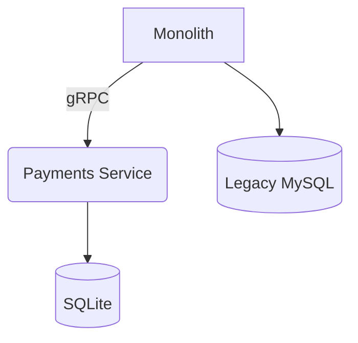

# ADR-XXXX: {Title}

> Architecture Decision Records capture a single architectural decision and its rationale.
> Use this template when you make a significant design or infrastructure choice that will
> have lasting impact on the codebase, development workflow, or system behavior.

---

## Record Metadata

| Field        | Value                     |
|-------------|---------------------------|
| **ID**       | ADR-XXXX                  |
| **Title**    | {Short, descriptive title} |
| **Status**   | proposed \| accepted \| superseded \| deprecated \| rejected |
| **Date**     | YYYY-MM-DD                |
| **Deciders** | {Comma-separated names of decision-makers} |
| **Consulted**| {Names of people whose input was sought} |
| **Approver** | {Final sign-off authority} |

---

## 1. Context

Describe the forces at play — the technical, business, or organizational circumstances
that make a decision necessary. What problem are we solving? What constraints exist?
What prior decisions or architectural principles bear on this choice?

**Guidance:** Write 3–6 paragraphs. Include references to related ADRs, external
standards, or prior research. Be objective; state facts, not conclusions.

**Example:**
> The monolith serving `/api/v2/*` now handles 40 000 req/s at peak with p99 latency
> of 1.2 s, exceeding the SLO of 800 ms. Previous ADR-0012 established that we
> decompose along domain boundaries. The payments domain accounts for 60 % of traffic
> and is the most frequently deployed module, making it the strongest candidate for the
> first service extraction.

---

## 2. Decision

State the decision in clear, unambiguous language. Use active voice and declarative
sentences. This section will be quoted in reviews, onboarding docs, and future ADRs,
so precision matters.

**Do:** "We will extract the Payments module into a standalone gRPC service deployed
on Kubernetes with a Circuit Breaker pattern between the monolith and the new service."

**Don't:** "We should probably look into extracting payments at some point."

**Example:**
> We will adopt SQLite as the primary datastore for the Customer 360 service,
> replacing the existing MySQL 5.7 sharded cluster. Data migration follows a
> progressive import strategy (ADR-0007) with zero-downtime cutover. All model
> access flows through Nine Router (localhost:20128/v1); no subsystem calls any
> provider directly.

---

## 3. Consequences

List the positive and negative consequences — both intended and unintended — that
follow from this decision. Be honest about trade-offs.

| Type            | Consequence |
|----------------|-------------|
| Positive        | {e.g., Independent deployability reduces release coordination overhead} |
| Positive        | {e.g., Team can choose its own tech stack within agreed boundaries} |
| Negative        | {e.g., Added network latency on formerly in-process calls} |
| Negative        | {e.g., Requires team to learn Kubernetes deployment workflows} |
| Neutral / Risk  | {e.g., Increased operational complexity — monitoring more services} |

**Guidance:** Include at least three entries. Mark risks that need mitigation with
a ⚠️ and link to the mitigation ADR if one exists.

---

## 4. Compliance

How will we ensure this decision is followed? What automated or manual gates exist?

- **Enforcement mechanism:** {e.g., CI lint rule, architecture review board check, quarterly audit}
- **Violation procedure:** {e.g., Exceptions require a written waiver approved by the Architecture Forum}
- **Measurement:** {e.g., Track number of services that bypass Nine Router; target = 0}

---

## 5. Alternatives Considered

| Alternative | Pros | Cons | Why Rejected |
|-------------|------|------|-------------|
| {Option A}  | {Brief list} | {Brief list} | {Primary reason} |
| {Option B}  | {Brief list} | {Brief list} | {Primary reason} |
| {Option C}  | {Brief list} | {Brief list} | {Primary reason} |

**Guidance:** List at least two meaningful alternatives. "Do nothing" is always an
option and should be included for completeness.

---

## 6. Cross-References

- **Supersedes:** [ADR-XXXX](./ADR-XXXX.md) — {Reason}
- **Superseded by:** [ADR-XXXX](./ADR-XXXX.md) — {Reason}
- **Related:** [ADR-XXXX](./ADR-XXXX.md), [ADR-XXXX](./ADR-XXXX.md)
- **Referenced by:** {Link to PR, design doc, or issue}

---

## 7. Approval Tracking

| Version | Date       | Approver          | Notes |
|---------|-----------|-------------------|-------|
| 1.0     | YYYY-MM-DD| {Name}            | Initial approval |
| 1.1     | YYYY-MM-DD| {Name}            | Amended §3 — added rollout timeline |

---

## 8. Version History

| Version | Date       | Author            | Changes |
|---------|-----------|-------------------|---------|
| 0.1     | YYYY-MM-DD| {Name}            | Draft |
| 0.2     | YYYY-MM-DD| {Name}            | Incorporated review feedback from {reviewer} |
| 1.0     | YYYY-MM-DD| {Name}            | Final — approved |

---

## 9. Appendix (Optional)

Include diagrams (architecture sketches, sequence diagrams in Mermaid), performance
data, benchmarking results, or any other supporting material referenced by the
decision sections above.



---

## 10. ADR Workflow

### Lifecycle

```
[Proposed] ──► [Accepted] ──► [Superseded]
    │                              ▲
    ▼                              │
 [Rejected]                   [Deprecated]
```

1. **Draft:** Author writes the ADR using this template.
2. **Proposed:** ADR is opened as a PR for review.
3. **Accepted:** PR is merged. The decision is now in effect.
4. **Superseded:** A later ADR replaces this one. The old ADR remains for history.
5. **Deprecated:** The decision is no longer relevant but not replaced.
6. **Rejected:** The decision was not accepted. The ADR remains as a record of why.

### Numbering

- ADRs are numbered sequentially: ADR-0001, ADR-0002, ...
- The number is assigned when the ADR is first proposed (PR opened).
- Never reuse a number — even rejected ADRs keep their number.

### Review Checklist

Before submitting an ADR for review:

- [ ] Is the decision clearly stated in one sentence?
- [ ] Is the context objective and fact-based?
- [ ] Are at least two alternatives considered?
- [ ] Are consequences (positive and negative) listed?
- [ ] Is the compliance section filled out?
- [ ] Are cross-references to related ADRs included?
- [ ] Is the status field set to `proposed`?
- [ ] Has the template instruction text been removed?

---

*Template version 2.0 — See [README.md](./README.md) for ADR workflow guidance.*
