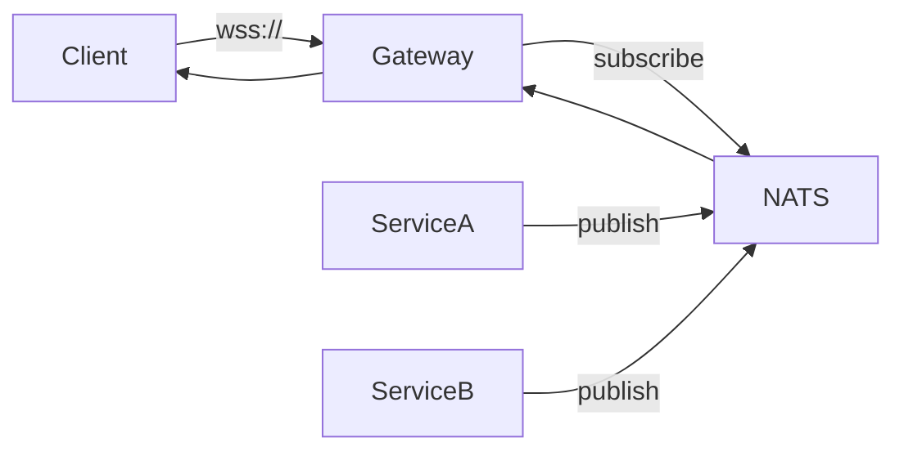

# RFC-XXXX: {Title}

> Request For Comments (RFC) is a lightweight proposal process for collecting
> structured feedback before committing to a design or implementation. Use this
> template early — while the design is still malleable — so reviewers can shape
> the outcome rather than react to a fait accompli.

---

## Metadata

| Field             | Value                     |
|-------------------|---------------------------|
| **RFC ID**        | RFC-XXXX                  |
| **Title**         | {Short, descriptive title} |
| **Author**        | {Name / Team}             |
| **Status**        | draft \| review \| accepted \| rejected \| withdrawn |
| **Target Release**| {Version or milestone}    |
| **Review Period** | YYYY-MM-DD – YYYY-MM-DD   |
| **Owners**        | {Comma-separated list}    |

---

## 1. Summary

A one-paragraph executive summary. Write this last — it's the elevator pitch that
tells a busy reader whether they need to read further.

**Example:**
> This RFC proposes introducing a WebSocket-based real-time notification bus to
> replace the current polling mechanism in the dashboard frontend. Expected benefits
> include a 10× reduction in API call volume, sub-200 ms notification delivery, and
> a unified subscription API for both web and mobile clients.

---

## 2. Motivation

Explain the problem we are solving. What is wrong with the current state? What user
pain points, technical debt, or business constraints drive this proposal? Include
data where possible — metrics, survey results, support ticket counts.

**Guidance:** Answer these questions:
- What is the current behaviour?
- Why is it insufficient?
- What happens if we do nothing?
- What evidence do we have that this is a real problem?

**Example:**
> The dashboard currently polls `/api/notifications` every 5 seconds. At 2 000
> concurrent users this generates 400 req/s even when no new notifications exist.
> The polling endpoint accounts for 35 % of total API traffic and costs
> approximately 400 req/s in additional compute load. User feedback (NPS score 6.2 for
> "notifications feel slow") confirms this is a perceived-latency issue.

---

## 3. Design

This is the core of the RFC. Describe the proposed solution in enough detail that
a team member could implement it. Cover:

> **Local-First Default:** Assume local storage (SQLite, filesystem), local inference
> (Ollama, vLLM, llama.cpp), and Nine Router (localhost:20128/v1) as the sole model
> gateway. Cloud services are opt-in exceptions that require explicit justification.

### 3.1 High-Level Architecture



### 3.2 API / Interface

Describe new endpoints, data structures, or contracts.

**Example (WebSocket message format):**
```json
{
  "type": "notification",
  "payload": {
    "id": "uuid",
    "kind": "alert|info|warning",
    "title": "string",
    "body": "string",
    "timestamp": "ISO8601"
  },
  "meta": {
    "messageId": "uuid",
    "correlationId": "uuid"
  }
}
```

### 3.3 Data Flow

Step-by-step walkthrough of the happy path and key edge cases.

### 3.4 Migration / Coexistence

How do we get from current state to target state without breaking existing users?
Detail the cutover plan, feature flags, or dual-run period.

### 3.5 Testing Strategy

- Unit tests: {What modules are testable in isolation?}
- Integration tests: {What contracts need verification?}
- Load tests: {What throughput/latency targets must be validated?}
- Chaos tests: {What failure modes will we inject?}

---

## 4. Drawbacks

Be candid about the downsides. Every design involves trade-offs. Acknowledging them
builds trust with reviewers and surfaces risks early.

| Drawback | Severity | Mitigation |
|----------|----------|-----------|
| {e.g., Adds 200–500 ms latency for notification delivery vs. in-process} | Medium | Acceptable trade-off for decoupling; measure in staging |
| {e.g., Requires WebSocket infrastructure (NATS, new gateway)} | Medium | Use local NATS instance; minimal ops overhead |
| {e.g., Older browsers (IE11) do not support WebSocket} | Low | IE11 support ends Q3; polyfill available in interim |

---

## 5. Alternatives

List meaningful alternatives that were considered and why they were not chosen.

| Alternative | Pros | Cons | Verdict |
|-------------|------|------|---------|
| **Option A:** Server-Sent Events | Simpler protocol, native HTTP/2 support | Unidirectional only; no native binary support | Rejected — need bidirectional |
| **Option B:** gRPC Bidirectional Stream | Strong typing, built-in backpressure | Heavier client library; harder to debug in browser | Rejected — too complex for this use case |
| **Option C:** Increase poll interval + cache | Zero infra change | Band-aid; does not solve latency perception | Rejected — not sufficient |

---

## 6. Unresolved Questions

List open items that need to be resolved before the RFC can be accepted.

1. {Question 1 — e.g., Should we use NATS JetStream for persistence?}
   - **Proposed by:** {reviewer name}
   - **Status:** under discussion \| resolved
   - **Resolution:** {Once decided, fill here}
2. {Question 2 — e.g., What is the SLA for notification delivery?}
   - **Proposed by:** {reviewer name}
   - **Status:** under discussion \| resolved
   - **Resolution:** {Once decided, fill here}

---

## 7. Review & Consensus Process

### 7.1 Timeline

| Phase | Duration | Activity |
|-------|----------|---------|
| Comment period | 5 business days | Reviewers leave feedback on the RFC |
| Revisions | 3 business days | Author addresses feedback, updates RFC |
| Final decision | 2 business days | Owners accept / reject / request changes |

### 7.2 Voting

- **Consensus required from:** {List of required approvers / teams}
- **Vote types:** +1 (approve), 0 (abstain / minor nits), -1 (block with reason)
- **Blocking rule:** A -1 vote must include a concrete, actionable objection.
  "I don't like it" is not sufficient; "We tried this in 2022 and it failed because X" is.

---

## 8. Implementation Plan

| Step | Owner | Estimated Effort | Depends On |
|------|-------|-----------------|-----------|
| 1. POC: WebSocket gateway | {Name} | 2 weeks | — |
| 2. Client SDK package | {Name} | 1 week | Step 1 |
| 3. Migrate dashboard | {Name} | 2 weeks | Step 2 |
| 4. Deprecate polling endpoint | {Name} | 0.5 week | Step 3 |

---

## 9. Version History

| Version | Date       | Author            | Changes |
|---------|-----------|-------------------|---------|
| 0.1     | YYYY-MM-DD| {Name}            | Initial draft |
| 0.2     | YYYY-MM-DD| {Name}            | Addressed feedback from {reviewer} |
| 1.0     | YYYY-MM-DD| {Name}            | Accepted |

---

*Template version 2.0 — See [README.md](./README.md) for RFC workflow guidance.*
