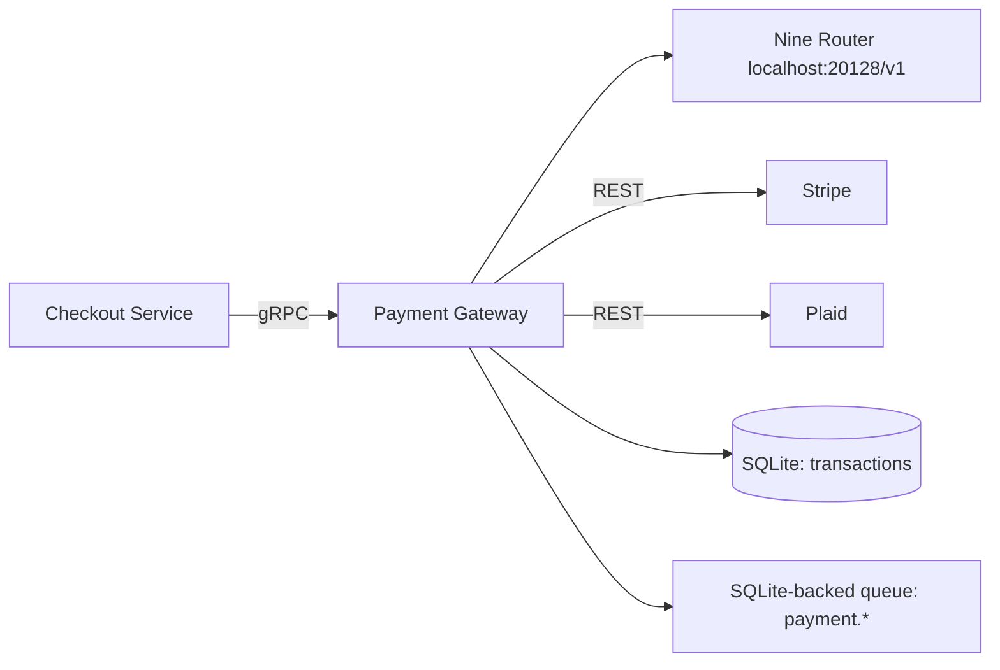
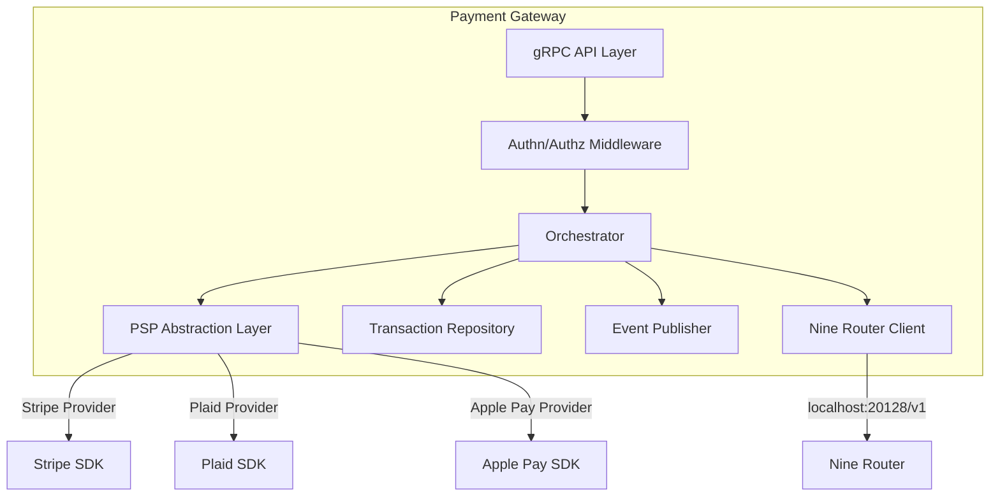
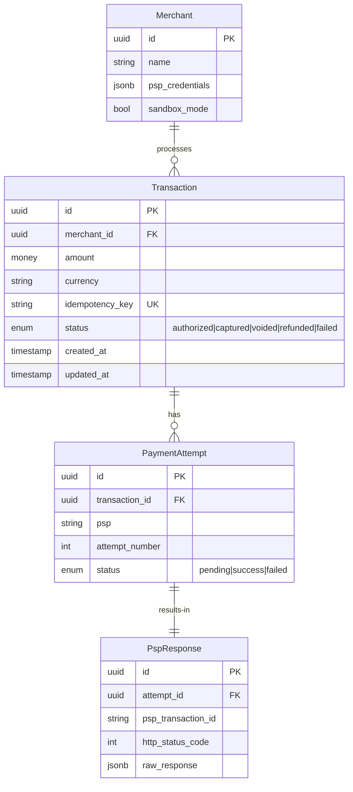

# Subsystem Spec: {Subsystem Name}

> Subsystem specifications define the boundary, responsibilities, and internal
> architecture of a distinct subsystem within a larger system. They serve as the
> single source of truth for developers working on or integrating with the subsystem.

---

## Metadata

| Field             | Value                     |
|-------------------|---------------------------|
| **Spec ID**       | SUBSYSTEM-XXXX            |
| **Subsystem**     | {Name of the subsystem}   |
| **Status**        | draft \| review \| approved \| superseded |
| **Owner**         | {Team / person}           |
| **Parent System** | {System this belongs to}  |
| **TRD Reference** | [TRD-XXXX](./TRD-XXXX.md) |
| **Version**       | {SemVer — e.g., 1.0.0}   |
| **Last Updated**  | YYYY-MM-DD                |

---

## 1. Overview

A concise description of the subsystem: what it is, what it does, and where it
fits in the overall architecture. Include a context diagram.

> **Local-First Default:** All subsystems default to local storage (SQLite,
> filesystem) and access models exclusively through Nine Router
> (localhost:20128/v1). No subsystem calls any model provider directly.

**Example:**
> The Payment Gateway subsystem is responsible for authorizing, processing, and
> reconciling customer payments. It sits between the Checkout Service (upstream)
> and external PSPs (downstream). It handles card payments via Stripe, digital
> wallets via Apple Pay / Google Pay, and bank transfers via Plaid.



---

## 2. Goals

Top-level objectives the subsystem must achieve. Use RFC 2119 language for
requirements (MUST, SHOULD, MAY — see §10).

| Goal | Priority | Requirement Language |
|------|----------|---------------------|
| Process a payment end-to-end in < 2 seconds | P1 | The gateway MUST complete authorization in ≤ 2 s p99 |
| Support 3+ payment providers simultaneously | P1 | The gateway MUST support at least 3 concurrent PSP integrations |
| Automatic retry with exponential backoff on transient failures | P2 | The gateway SHOULD retry failed PSP calls up to 3 times |
| Provide a sandbox environment for integration testing | P2 | The gateway MUST provide a sandbox mode |
| Store transaction history for 7 years (compliance) | P1 | The gateway MUST retain transaction records for ≥ 7 years |

---

## 3. Non-Goals

Explicit exclusions that define the subsystem boundary.

- {e.g., Fraud detection — handled by a separate Fraud Service; the gateway only forwards risk scores}
- {e.g., Subscription billing — managed by the Billing Service; the gateway only processes single payments}
- {e.g., Multi-currency ledger — the gateway processes in settlement currency; FX conversion is upstream}
- {e.g., Direct PCI-DSS scope — the gateway uses Stripe Elements; cards never touch our servers}

---

## 4. Requirements (RFC 2119)

### 4.1 MUST Requirements

These are mandatory; failure to meet them is a system defect.

| ID | Requirement | Verification |
|----|-------------|-------------|
| REQ-M01 | The subsystem MUST authenticate all incoming requests via mTLS | Integration test |
| REQ-M02 | The subsystem MUST log every payment attempt with idempotency key | Log inspection |
| REQ-M03 | The subsystem MUST reject payments exceeding $10 000 with a clear error message | Unit test |
| REQ-M04 | The subsystem MUST return a consistent error schema for all failure modes | Contract test |
| REQ-M05 | The subsystem MUST encrypt all stored PII at rest using AES-256 | Security audit |

### 4.2 SHOULD Requirements

High-priority but not blocking; address if feasible.

| ID | Requirement | Verification |
|----|-------------|-------------|
| REQ-S01 | The subsystem SHOULD provide a health check endpoint | Integration test |
| REQ-S02 | The subsystem SHOULD cache PSP connection pools to reduce latency | Load test |
| REQ-S03 | The subsystem SHOULD emit OpenTelemetry spans for all external calls | Trace inspection |

### 4.3 MAY Requirements

Optional; include if time and resources permit.

| ID | Requirement | Verification |
|----|-------------|-------------|
| REQ-MY01 | The subsystem MAY expose an admin UI for manual payment retries | E2E test |
| REQ-MY02 | The subsystem MAY support webhook replay for debugging | Manual test |

---

## 5. Architecture

### 5.1 High-Level Architecture



### 5.2 Component Responsibilities

| Component | Responsibility |
|-----------|---------------|
| **gRPC API Layer** | Exposes `Authorize`, `Capture`, `Void`, `Refund`, `GetTransaction` RPCs |
| **Orchestrator** | Implements the payment flow state machine; handles idempotency, retries, timeouts |
| **PSP Abstraction Layer** | Uniform interface over all payment providers; adapter per provider |
| **Transaction Repository** | Stores and retrieves transaction records; implements TTL-based archival |
| **Event Publisher** | Publishes `payment.authorized`, `payment.captured`, `payment.failed` events |

### 5.3 State Machine

```
Authorized ──► Captured ──► Settled
   │              │
   ▼              ▼
Voided         Refunded
   │              │
   ▼              ▼
Closed         Refunded_Partial
```

---

## 6. Interfaces

### 6.1 Internal Interfaces (gRPC)

```protobuf
service PaymentGateway {
  rpc Authorize(AuthorizeRequest) returns (AuthorizeResponse);
  rpc Capture(CaptureRequest) returns (CaptureResponse);
  rpc Void(VoidRequest) returns (VoidResponse);
  rpc Refund(RefundRequest) returns (RefundResponse);
  rpc GetTransaction(GetTransactionRequest) returns (Transaction);
}

message AuthorizeRequest {
  string idempotency_key = 1;
  string merchant_id = 2;
  Money amount = 3;
  PaymentMethod payment_method = 4;
  map<string, string> metadata = 5;
}
```

### 6.2 External Interfaces (PSP Adapters)

| PSP | Protocol | Authentication | Idempotency |
|-----|----------|---------------|-------------|
| Stripe | REST + Webhooks | Secret key (HTTP header) | `Idempotency-Key` header |
| Plaid | REST | Client ID + Secret (JWT) | Idempotency key in body |
| Apple Pay | SDK + REST | Merchant certificate | Transaction ID |

### 6.3 Event Contracts

Events are published to the local SQLite-backed event queue:

```json
{
  "specversion": "1.0",
  "type": "payment.authorized",
  "source": "/payment-gateway",
  "id": "uuid",
  "time": "ISO8601",
  "data": {
    "transaction_id": "uuid",
    "merchant_id": "string",
    "amount": { "currency": "USD", "value": 2999 },
    "payment_method_type": "card",
    "psp": "stripe"
  }
}
```

---

## 7. Data Model

### 7.1 Entity Relationship



### 7.2 Key Schema Details

**`transactions` table:**
```json
{
  "id": "uuid (PK)",
  "merchant_id": "uuid (FK, indexed)",
  "amount_cents": "integer",
  "currency": "ISO 4217 (3 chars)",
  "idempotency_key": "string (UK, indexed, TTL 24h)",
  "status": "enum: authorized, captured, voided, refunded, failed",
  "metadata": "jsonb (max 4KB)",
  "created_at": "timestamp (indexed for range queries)",
  "updated_at": "timestamp"
}
```

---

## 8. Failure Modes

| Failure Mode | Detection | Impact | Mitigation |
|-------------|-----------|--------|-----------|
| PSP timeout (> 5 s) | gRPC deadline exceeded | Transaction marked as `failed`; user retries | Retry with different PSP (if available); alert on-call |
| PSP returns 500 | HTTP status code check | Transaction marked as `failed` | Exponential backoff retry × 3; then dead-letter queue |
| Database unreachable | Connection pool exhaustion | All transactions fail; read-only fallback not possible | Circuit breaker; P1 alert; failover to read replica |
| Idempotency key collision | UK violation on insert | Duplicate detected; return existing transaction | Silent success — return cached response |
| Event delivery failure | Unacknowledged event in queue | Payment status not propagated | Queue dead-letter table; manual replay tool |

---

## 9. Security Considerations

### 9.1 Authentication & Authorization

- **Inbound:** All gRPC calls require a valid service-to-service JWT issued by the
  Auth Service. Tokens are scoped to specific RPCs.
- **Outbound:** PSP credentials are stored in Vault and injected as environment
  variables at deployment time. Never logged or exposed in error messages.

### 9.2 Data Protection

| Data Class | Encryption | Access Control | Audit |
|-----------|-----------|---------------|-------|
| PII (merchant name, email) | AES-256 at rest | Role-based: Admin, Support | All reads logged |
| Payment credentials (tokens) | Vault transit encryption | Service account only | All access logged |
| Transaction metadata | AES-256 at rest | Internal services only | By request |

### 9.3 Compliance

- **PCI-DSS:** The subsystem is designed as a SAQ A merchant — card data is
  tokenized by Stripe; our systems never handle raw PAN.
- **GDPR:** Support `DeleteTransaction` RPC for right-to-erasure requests.
- **SOC 2:** Audit trail for all admin operations; logs retained 90 days.

---

## 10. Observability

### 10.1 Logging

| Event | Level | Structured Fields |
|-------|-------|-------------------|
| Authorize request received | INFO | `tx_id`, `merchant_id`, `amount`, `psp` |
| PSP call succeeded | INFO | `tx_id`, `psp`, `latency_ms`, `psp_tx_id` |
| PSP call failed | WARN | `tx_id`, `psp`, `error`, `attempt` |
| Idempotency hit | DEBUG | `tx_id`, `idempotency_key`, `original_response` |
| Circuit breaker opened | ERROR | `psp`, `failure_count` |

### 10.2 Metrics (Prometheus)

| Metric | Type | Labels |
|--------|------|--------|
| `payment_attempts_total` | Counter | `psp`, `status`, `merchant_id` |
| `payment_latency_seconds` | Histogram | `psp`, `operation` (authorize/capture) |
| `psp_errors_total` | Counter | `psp`, `error_code` |
| `circuit_breaker_state` | Gauge | `psp` (0=closed, 1=open, 2=half-open) |
| `idempotency_hit_total` | Counter | — |

### 10.3 Alerts

| Alert | Condition | Severity | Runbook |
|-------|-----------|----------|---------|
| High payment failure rate | > 5 % failures over 5 min | P1 | Link to runbook |
| High PSP latency | p99 > 5 s for 10 min | P2 | Investigate PSP status page |
| Circuit breaker open | Any PSP circuit breaker open | P1 | Manual failover procedure |

---

## 11. RFC 2119 Language Guide

When writing requirements in this document, use the following keywords as defined
by [RFC 2119](https://datatracker.ietf.org/doc/html/rfc2119):

| Keyword | Meaning |
|---------|---------|
| **MUST** / **MUST NOT** | Absolute requirement / prohibition |
| **SHOULD** / **SHOULD NOT** | Strongly recommended; exceptions require written justification |
| **MAY** | Optional; entirely at the discretion of the implementer |

These keywords MUST be uppercase when used in the Requirements section to denote
normative requirements. Lowercase uses (must, should, may) carry no special meaning.

---

## 12. Open Questions

| # | Question | Proposed By | Status | Resolution |
|---|----------|------------|--------|-----------|
| 1 | Should we support PayPal as a fourth PSP? | Product | open | — |
| 2 | What is the maximum transaction amount before manual review? | Compliance | resolved | $10 000 |
| 3 | Do we need to support WebSocket-based real-time status updates? | Engineering | resolved | No — polling via GetTransaction is sufficient |

---

## 13. Related Documents

- [TRD-XXXX: Payment Gateway Technical Requirements](./TRD-XXXX.md)
- [PRD-XXXX: Checkout Experience](./PRD-XXXX.md)
- [ADR-0015: Choosing Stripe as Primary PSP](../adrs/ADR-0015.md)
- [ADR-0020: Event Bus Adoption](../adrs/ADR-0020.md)

---

## 14. Version History

| Version | Date       | Author | Changes |
|---------|-----------|--------|---------|
| 0.1     | YYYY-MM-DD| {Name} | Initial draft |
| 0.2     | YYYY-MM-DD| {Name} | Added data model and failure modes |
| 0.3     | YYYY-MM-DD| {Name} | Updated PSP adapters — removed Braintree |
| 1.0     | YYYY-MM-DD| {Name} | Approved for implementation |

---

*Template version 2.0 — See [README.md](./README.md) for subsystem specification workflow guidance.*
