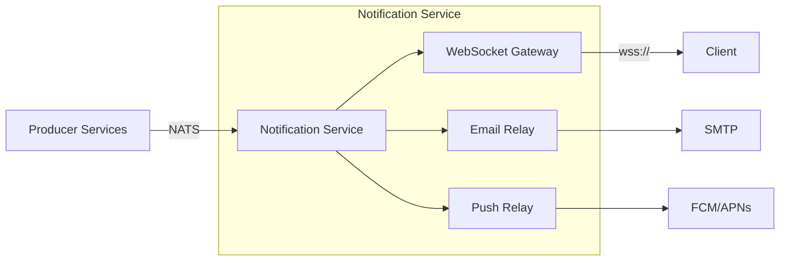
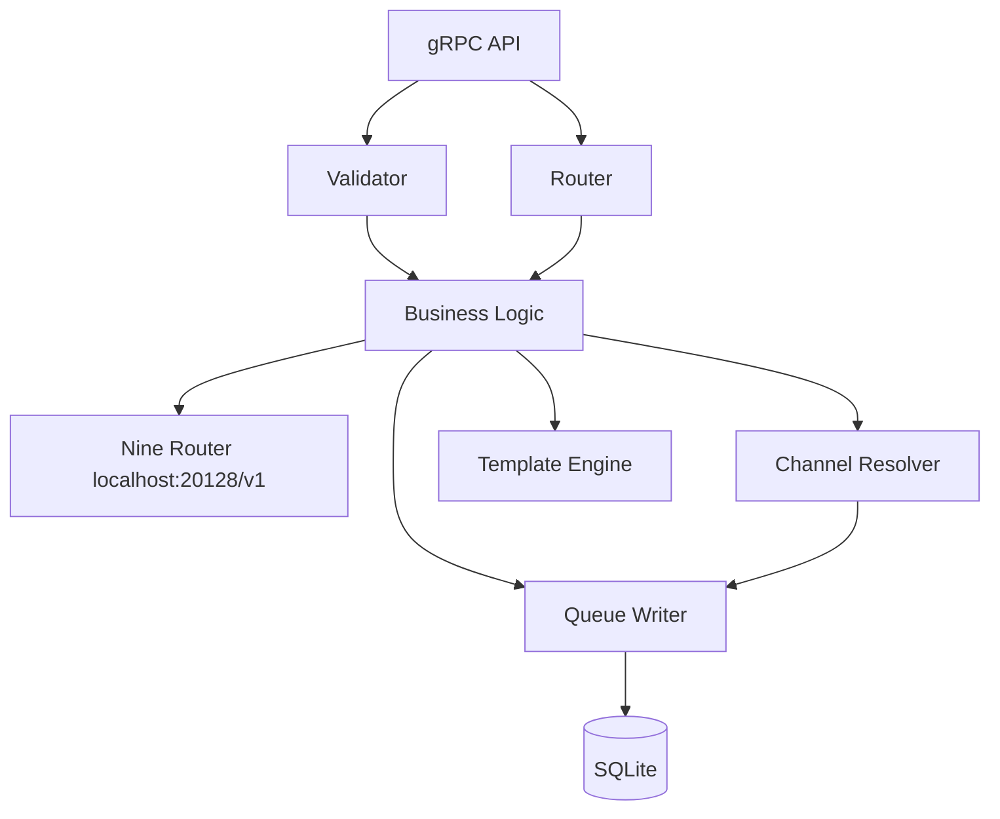
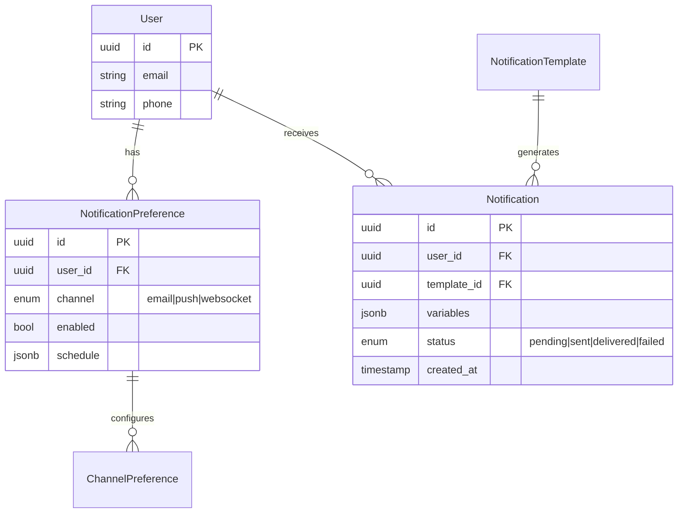

# TRD-XXXX: {System / Component Name}

> Technical Requirements Document (TRD) specifies the non-functional and
> architectural constraints that a system must satisfy. It complements the PRD
> by translating product intent into engineering requirements.

---

## Metadata

| Field             | Value                     |
|-------------------|---------------------------|
| **TRD ID**        | TRD-XXXX                  |
| **System**        | {Name of system / component} |
| **Status**        | draft \| review \| approved \| superseded |
| **Owner**         | {Engineering lead / team} |
| **PRD Reference** | [PRD-XXXX](./PRD-XXXX.md) |
| **Target Release**| {Version or date}         |
| **Last Updated**  | YYYY-MM-DD                |

---

## 1. Overview

A brief description of the system or component and how it fits into the larger
architecture. Include a context diagram or reference to the relevant subsystem
spec.

**Example:**
> The Notification Service is a standalone gRPC service responsible for delivering
> real-time and batched notifications to end users. It replaces the polling-based
> mechanism described in PRD-0042. It consumes events from NATS JetStream, enriches
> them with user preferences, and delivers via WebSocket, email, or push depending
> on the channel preference.



---

## 2. Architecture

### 2.1 System Context

Describe where this system lives in the broader architecture. What depends on it?
What does it depend on?

### 2.2 Component Diagram



### 2.3 Technology Decisions

| Decision | Choice | Rationale |
|----------|--------|-----------|
| Language | Go 1.22 | Team expertise; excellent gRPC and concurrency support |
| Transport | gRPC with TLS | Strong typing, bidirectional streaming, native HTTP/2 |
| Message broker | SQLite-backed task queue | Durable queues, at-least-once delivery, zero external deps |
| Database | SQLite 3 | Local relational data (templates, preferences); JSON columns for flexible config |

**Technology decision format:** Every technology choice should include a brief
rationale (2–3 sentences) explaining why this option was chosen over alternatives.
If a technology was considered and rejected, reference the relevant RFC or ADR.

---

## 3. Non-Functional Requirements

### 3.1 Performance & Scalability

| Requirement | Target | Measurement |
|-------------|--------|-------------|
| Throughput | ≥ 10 000 notifications / second | Load test with k6 |
| P99 delivery latency (WebSocket) | ≤ 200 ms | Local tracing span (OpenTelemetry) |
| P99 delivery latency (Email) | ≤ 60 s | Local tracing span (OpenTelemetry) |
| Concurrent WebSocket connections | ≥ 50 000 per gateway instance | Staging load test |
| Horizontal scaling | Stateless; add replicas behind L4 LB | Auto-scaling based on CPU > 70 % |

### 3.2 Availability & Durability

| Requirement | Target | Notes |
|-------------|--------|-------|
| Uptime SLA | 99.95 % | Excludes planned maintenance with 7-day notice |
| Durability | At-least-once delivery | Consumer must deduplicate via `messageId` |
| Disaster recovery | RPO ≤ 5 min, RTO ≤ 30 min | Cross-region NATS mirroring |

### 3.3 Resource Budget

| Resource | Per-instance limit | Burst |
|----------|-------------------|-------|
| CPU | 2 cores | 4 cores for ≤ 30 s |
| Memory | 4 GB | 6 GB for ≤ 60 s |
| Network | 100 Mbps | 200 Mbps |

---

## 4. Target Platforms

| Platform | Supported | Min Version | Notes |
|----------|-----------|-------------|-------|
| Web (Chrome, Firefox, Safari, Edge) | Yes | Last 2 major versions | WebSocket via native API |
| iOS | Yes | iOS 16+ | Push via APNs; WebSocket in-app |
| Android | Yes | Android 13+ | Push via FCM; WebSocket in-app |
| Email | Yes | — | SMTP relay; HTML + plaintext fallback |

---

## 5. Interfaces & Protocols

### 5.1 gRPC Service Definition

```protobuf
service NotificationService {
  // Send delivers a notification via the user's preferred channel.
  rpc Send(SendRequest) returns (SendResponse);

  // Subscribe opens a bidirectional stream for real-time delivery.
  rpc Subscribe(SubscribeRequest) returns (stream Notification);
}

message SendRequest {
  string user_id = 1;
  string template_id = 2;
  map<string, string> variables = 3;
  ChannelOverride channel_override = 4;
}

message SendResponse {
  string notification_id = 1;
  DeliveryStatus status = 2;
}
```

### 5.2 REST Endpoints (Admin / Health)

| Method | Path | Purpose |
|--------|------|---------|
| GET | `/healthz` | Liveness probe (returns 200) |
| GET | `/readyz` | Readiness probe (checks NATS, DB connectivity) |
| GET | `/metrics` | Prometheus metrics endpoint |
| GET | `/admin/queue-depth` | Current NATS queue depth (internal observability) |

### 5.3 Event Subjects (SQLite-backed Queue)

| Subject | Direction | Schema |
|---------|-----------|--------|
| `notification.send` | Producer → Service | `SendRequest` (protobuf) |
| `notification.delivered` | Service → Consumer | `DeliveryReceipt` (protobuf) |
| `notification.failed` | Service → Consumer | `DeliveryFailure` (protobuf) |

---

## 6. Data Model

### 6.1 Entity Relationship



### 6.2 Key Schemas

**`notification_preferences` table:**
```json
{
  "user_id": "uuid",
  "channel": "websocket",
  "enabled": true,
  "schedule": {
    "mute_from": "22:00",
    "mute_to": "08:00",
    "timezone": "America/New_York"
  },
  "created_at": "timestamp",
  "updated_at": "timestamp"
}
```

---

## 7. Failure Modes

| Failure Mode | Symptom | Detection | Mitigation |
|-------------|---------|-----------|-----------|
| SQLite queue locked / busy | Messages not consumed | Health check fails; queue depth increases | Retry with backoff; fall back to in-memory buffer and retry |
| Database unavailable | Preferences/templates fail to load | Connection pool exhaustion | Cache preferences in local memory; serve stale templates |
| Downstream email relay down | Email queue grows | SMTP connection timeout | Retry with exponential backoff (max 3); alert if > 1000 queued |
| WebSocket connection lost | Client disconnects | Client library `onclose` event | Auto-reconnect with backoff; client replays missed messages on reconnect |

---

## 8. Security

### 8.1 Authentication & Authorization

- **Inter-service auth:** mTLS between all gRPC services
- **Client auth:** JWT bearer token validated against Auth Service
- **WebSocket auth:** Token presented during upgrade handshake; validated before stream opens

### 8.2 Data Protection

- **In transit:** TLS 1.3 for all external and internal communication
- **At rest:** AES-256 encryption for database; local keyring (OS keychain or env-based)
- **PII:** `user_id` and `email` are the only PII fields; audit log every access

### 8.3 Rate Limiting

| Limit | Scope | Enforcement |
|-------|-------|-------------|
| 100 requests / second | Per user (Send API) | Token bucket in gateway |
| 10 000 requests / second | Global | Local reverse proxy (Caddy / Nginx) at ingress |

### 8.4 Compliance

- **GDPR:** Support data deletion request via `DeleteUserData` RPC
- **SOC 2:** Audit logs for all admin operations; retention ≥ 90 days

---

## 9. Observability

### 9.1 Logging

| Event | Level | Fields |
|-------|-------|--------|
| Notification sent | INFO | `user_id`, `channel`, `template_id`, `message_id` |
| Delivery failed | WARN | `user_id`, `channel`, `error`, `retry_count` |
| Downstream timeout | ERROR | `channel`, `destination`, `duration_ms` |
| Rate limit exceeded | WARN | `user_id`, `limit`, `window` |

### 9.2 Metrics (Prometheus)

| Metric | Type | Labels |
|--------|------|--------|
| `notifications_sent_total` | Counter | `channel`, `status` |
| `notifications_delivery_duration_seconds` | Histogram | `channel` |
| `websocket_connections_active` | Gauge | `gateway_instance` |
| `nats_consumer_lag` | Gauge | `subject`, `consumer` |

### 9.3 Alerts

| Alert | Condition | Severity | Response |
|-------|-----------|----------|---------|
| High delivery latency | P99 > 500 ms for 5 min | P1 | Rotate on-call |
| Consumer lag growing | Lag > 10 000 for 2 min | P2 | Investigate during business hours |
| Error rate spike | > 5 % errors for 5 min | P1 | Page on-call |

---

## 10. Migration Plan

### Phase 1: Dual-Write (Week 1–2)

Both old (polling) and new (WebSocket) systems run in parallel. Feature flag
controls which users see the new path.

### Phase 2: Shadow Traffic (Week 3)

Mirror 10 % of production traffic to the new service; compare latencies and
delivery rates. Do not serve responses to users yet.

### Phase 3: Cutover (Week 4)

Gradually ramp new service: 1 % → 10 % → 50 % → 100 % over 5 days. Monitoring
dashboards must be green at each step for ≥ 4 hours before proceeding.

### Phase 4: Decommission (Week 5)

Remove polling endpoint, old code paths, and deprecated data structures.

---

## 11. Open Questions & Decisions Log

| # | Question | Proposed By | Status | Resolution |
|---|----------|------------|--------|-----------|
| 1 | Should we support SMS channel in v1? | Product | resolved | No — deferred to Q3 |
| 2 | What is the max payload size for a notification? | Security | resolved | 64 KB (hard limit at gateway) |
| 3 | Do we need persistent WebSocket message replay? | Engineering | open | — |

---

## 12. Version History

| Version | Date       | Author | Changes |
|---------|-----------|--------|---------|
| 0.1     | YYYY-MM-DD| {Name} | Initial draft |
| 0.2     | YYYY-MM-DD| {Name} | Added data model section per review |
| 0.3     | YYYY-MM-DD| {Name} | Updated SLA targets after capacity planning |
| 1.0     | YYYY-MM-DD| {Name} | Approved |

---

*Template version 2.0 — See [README.md](./README.md) for TRD workflow guidance.*
